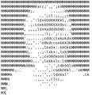

# Counter
Counter was our Operative System project for the second year of Bachelor in Computer Science in University of Trento (Italy). The main focus of this project is to count the occurrences of chars inside one or more files (normal ASCII). Our idea was to make all as extensible and modular as possible. There are several components, every of them has a specific task. A little brief:

* **Counter**: the counter spawns the reporter and the analyzer.
* **Reporter**: the reporter creates the terminal user interface and communicates with the analyzer.
* **Analyzer**: the analyzer takes all inputs from the user and finds all files given a directory. Then, while files are being discovered,  analyzer sends founded ones to managers.
* **Manager**: the manager takes files and split them in several works. A work starts from a specific point of the file and ends in another. When works are ready they are sent to workers.
* **Worker**: the worker takes the file, the start point end the end point. After that he reads the portion of the file

Obs: With a small amount of work is possible to change the lowest component of the system, the worker, to allow the system to handle different types of problems, not only counting occurrences

## Goal
The goal of this project is to learn most of C system calls and to take confident with GNU/Linux environment.

## Team

