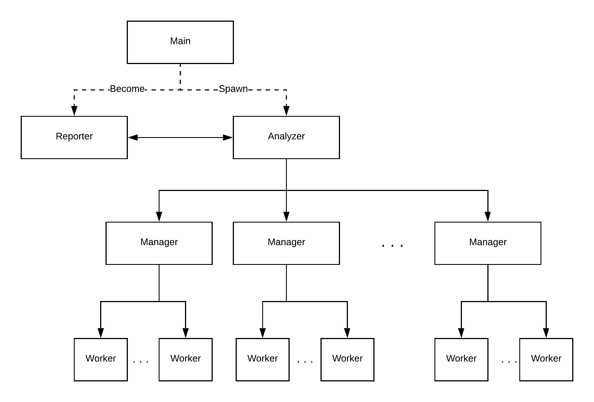
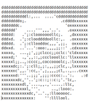
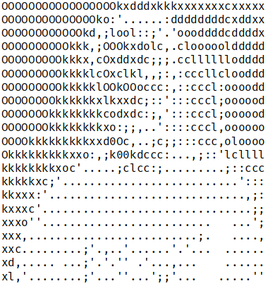
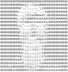

# Counter
Counter was our Operative System project for the second year of Bachelor in Computer Science in University of Trento (Italy). The main focus of this project is to count the occurrences of chars inside one or more files (normal ASCII). Our idea was to make all as extensible and modular as possible. There are several components, every of them has a specific task. A little brief:

* **Counter**: the counter spawns the reporter and the analyzer.
* [**Reporter**](./src/reporter/README.md): the reporter creates the terminal user interface ([**Tui**](./src/tui/README.md)) and communicates with the analyzer.
* [**Analyzer**](./src/analyzer/README.md): the analyzer takes all inputs from the user and finds all files given a directory. Then, while files are being discovered, analyzer sends founded ones to managers.
* [**Manager**](./src/manager/README.md): the manager takes files and split them in several works. A work starts from a specific point of the file and ends in another. When works are ready they are sent to workers.
* [**Worker**](./src/worker/README.md): the worker takes the file, the start point end the end point. After that he reads the portion of the file

Obs: With a small amount of work is possible to change the lowest component of the system, the worker, to allow the system to handle different types of problems, not only counting occurrences

## Goal
The goal of this project is to learn most of C system calls and to take confidence with GNU/Linux environment.

## Implementation choices
There are several implementation choices inside all files in components' folder. Here are listed some common choices.

### Memory
Inside all code, except worker, when we allocate some memory on the heap we always control if the memory was allocated correctly. In most cases if malloc fails we closed the program because we think that if a user saturated the RAM, he/she may prefer that some programs could free it to make the computer more usable.
The only component that checks the amount of free memory is the worker. Before reading from a file it checks if there is enough free space in memory in order to read its work amount. If not it allocates 50% of the free memory and reads multiples times from the file moving the cursor. This check is made only in the worker because it is the component with the highest memory usage. Nowadays computers have enough memory to support other components and the check seems, for us, an useless overhead. We made some test to prove our decision:

| Number of files | size    |
|-----------------|---------|
|0                |3.93 MiB |
|1                |4.13 MiB |
|10               |4.38 MiB |
|100              |5.19 MiB |
|1000             |13.52 MiB|
|10000            |94.05 MiB|

The files were empty and all inside the same folder but we think that, also with different configurations, the memory usage is similar. The amount of memory was calculated after the workers ended their tasks. 

### Empty folders
We decided not to store information about empty folders. 
If files are added later in a folder (that was previously empty) user needs to analyze it again

### Changing file runtime
If a file is changed while the workers are reading there are several possibilities:
  * if the updated file is shorter/longer than the old one, we decided to handle the error but the statistic are not reliable,
    so if the user want the correct one he/she needs to analyze it again.
  * if the updated file has different permissions, workers are still able to read the file because
    permissions are only verified when a file is opened and the statistic will be saved.
  * if the file has been deleted, workers are still able to read the file because 
    as long as there is an open file descriptor the file’s data will not be deleted and the inode will not be freed. The statistic will be saved anyway.
In any case the purpose of the program is to analyze files, so if the user changes them runtime it completely lose its original meaning (errors must be handled anyway).

### Manager/Worker amount changes
If the manager/worker amount changes during the program execution we decided not to kill them 
(except the case when the user wants less processes, and rare occasions - i.e. communication errors), 
instead we reorganized their jobs.
If one or both of those amounts are equals (or below) zero, their task are stored until the number changes.

### File distribution
Files are scheduled to managers using a priority queue. In some cases this is the fairest way to assign them, 
but, in some occasions (few and/or small files)  only a small amount of managers are involved (some/all files are analyzed before the whole distribution).
This happens because the priority is based on the amount of file, assigned to the manager, which still needs to be processed.
We thought about changing the priority with the total number of file assigned, but this isn't fair with big files 
and analyzer shouldn't access files in any way to know their dimension.

### Thread
We decided to use threads in all components in order to improve the user experience, giving them the impression of running every single component in a concurrent way, just like an Operating System does with processes. Every part of a component seems to be always running, but in reality there are a lot of context switching between several threads.

## Known issues
Here are listed some known issues:

* if / is given as path the program interrupt itself in some random moment. This is caused by some strange file inside system's folders. We tried to "make a rule" in order to handle them but there are too many cases (we didn't have neither the time nor the means). Here are listed some that we handled (only for information):
    * there are files that have a specific amount of space on the disk (4096 bytes) but inside the file there is only one char (i.e. /sys/kernel/mm/hugepages/hugepages-2048kB/free_hugepages). Inside manager we first use lseek to compute the dimension but if a worker fails, we try to compute the dimension reading all file and take only the amount of read chars. This is against the professor's directives but is the only way to handle it (i.e. we saw wc unix command source code and also wc use this techniques).
    * there are files that have multiple EOF or other special chars that block the read from the file descriptor before the real amount is read
* if analyzer and reporter are opened in two different terminals there is the possibility to close one and open it again. The two components keep the communication up but if reporter is closed and open again several times very quickly there is the possibility that the analyzer will die without any error message (we spread a lot of error messages inside all the code, but we didn't get the problem)
* The executable files needs to be called inside the bin directory, otherwise the program won't work (except for the reporter and worker). 
* There is the possibility that the user clear the FIFO manually. If so the analyzer/reporter communicate will be compromised (we tried to delete FIFOs after creation but other major problems were found)
* If where we create the FIFOs does already exist a file with the same name owned by root with no reading/writing permission for the current user the FIFO can not be accessed

## GIF

## Team

