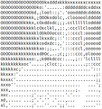

# Counter
Counter was our Operative System project for the second year of Bachelor in Computer Science in University of Trento (Italy). The main focus of this project is to count the occurrences of chars inside one or more files (normal ASCII). Our idea was to make all as extensible and modular as possible. There are several components, every of them has a specific task. A little brief:

* **Counter**: the counter spawns the reporter and the analyzer.
* [**Reporter**](./src/reporter/README.md): the reporter creates the terminal user interface ([**Tui**](./src/tui/README.md)) and communicates with the analyzer.
* [**Analyzer**](./src/analyzer/README.md): the analyzer takes all inputs from the user and finds all files given a directory. Then, while files are being discovered,  analyzer sends founded ones to managers.
* [**Manager**](./src/manager/README.md): the manager takes files and split them in several works. A work starts from a specific point of the file and ends in another. When works are ready they are sent to workers.
* [**Worker**](./src/worker/README.md): the worker takes the file, the start point end the end point. After that he reads the portion of the file

Obs: With a small amount of work is possible to change the lowest component of the system, the worker, to allow the system to handle different types of problems, not only counting occurrences

## Goal
The goal of this project is to learn most of C system calls and to take confident with GNU/Linux environment.

## Implementation choices
There are several implementations choices inside all files in compontens' folder. Here are listed some common choices.

### Memory
Inside all code except worker when we allocate some memory on the heap we always control if the allocation gone well. In the most case if the malloc fail we closed the program because we think that if a user has saturated the RAM may prefer that some program unlock it to make computer more usable.
The only component that checks the amount of free memory is the worker. Before reading from a file he checks if there is a enough free space in memory in order to read his work amount. If not he allocates the 50% of the free memory and read multiples times from the file moving the cursor. This check is made only in worker because it is the only component of that do a high memory usage task. Nowadays computers have enough memory to support other component and the check seem, for us, an useless overhead. We made some test to prove our decision:

| Number of files | size   |
|-----------------|--------|
|0                |2.83 mb |
|1                |3.03 mb |
|10               |3.08 mb |
|100              |3.93 mb |
|1000             |12.13 mb|
|10000            |93.39 mb|

The files were empty and all inside the same folder but we think that, also with different configurations, the memory usage is similar.

### Thread
We decided to use thread in all components in order to improve the user experience. Like Operative System make several processes to seem run concurrently for the user we want the same feeling inside our program. Every part of a component seems always running, but in reality there are a lot of context switching between several threads.

## Known issues
Here are listed some known issues:

* if / are given as path the program interrupt itself in some random moment. This is caused by some strange file inside system folder. We try to "make a rule" in order to handle them but there are too much cases. Here are listed some that we handle (only for information):
    * there are files that have a specific amount of space on the disk (4095 bytes) but inside the file there is only one char (i.e. /sys/kernel/mm/hugepages/hugepages-2048kB/free_hugepages). Inside manager we first use lseek to compute the dimension but if a worker fails we try to compute the dimension reading all file and take only the read chars. This is against the Professor's directives but is the only way to handle it (i.e. we saw wc unix command source code and also wc use this techniques).
    * there are files that have multiple EOF or other special chars that block the read from pipe before the real amount is read
* if analyzer and reporter are opened in two different terminals there is the possibility to close one and open it again. The two components keep the communication up but if reporter is closed and open again several times very quickly there is the possibility that the analyzer will die without any error message (we spread a lot of error messages inside all the code, but we didn't get the problem)

## Team

