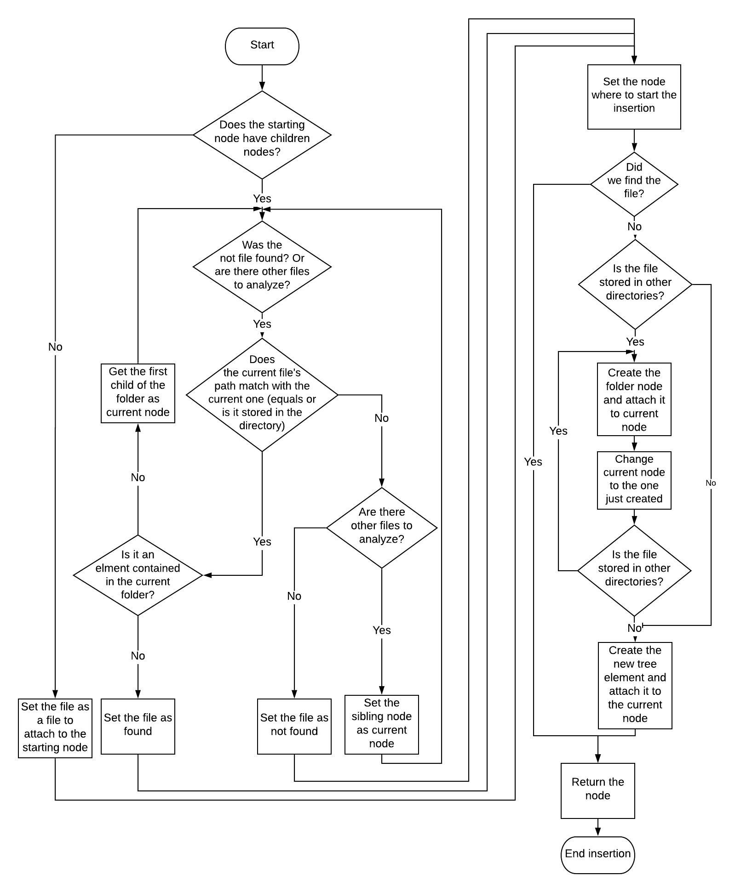
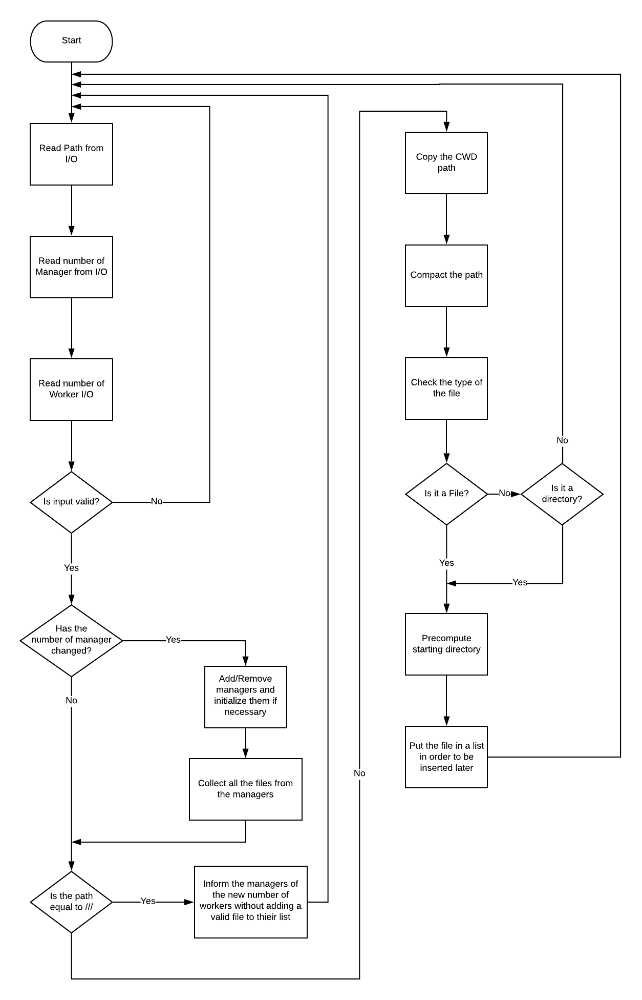
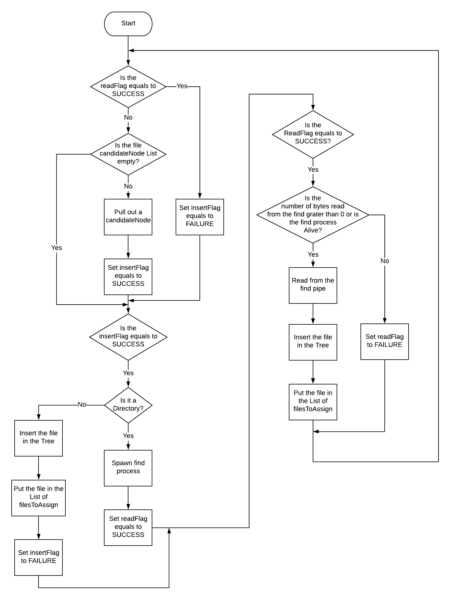
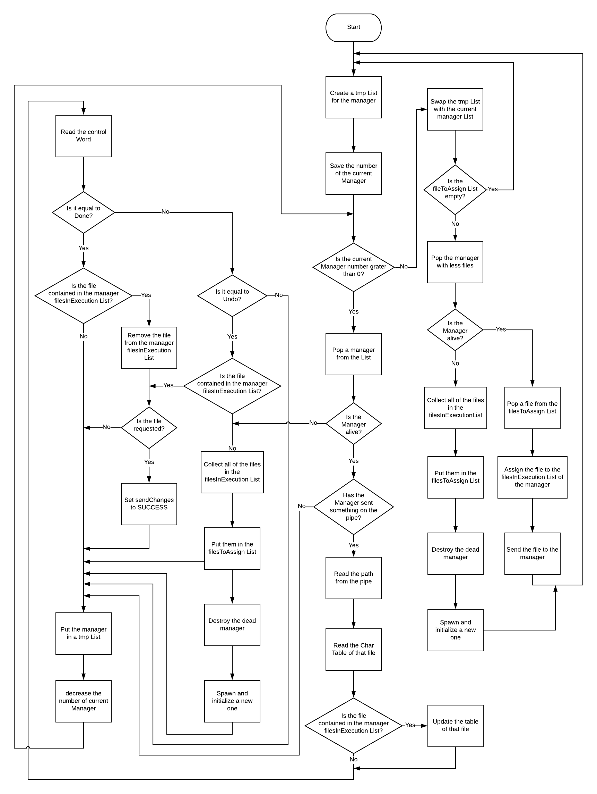
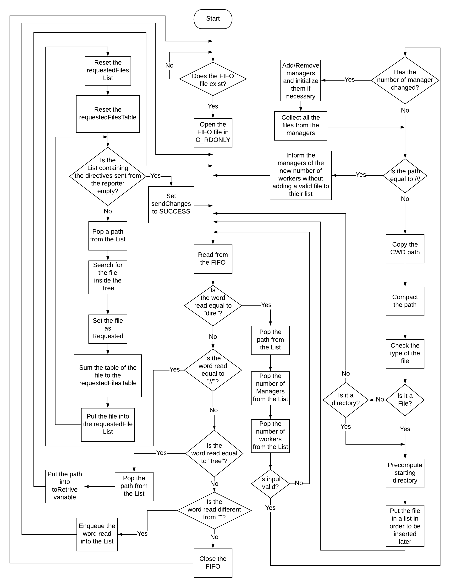
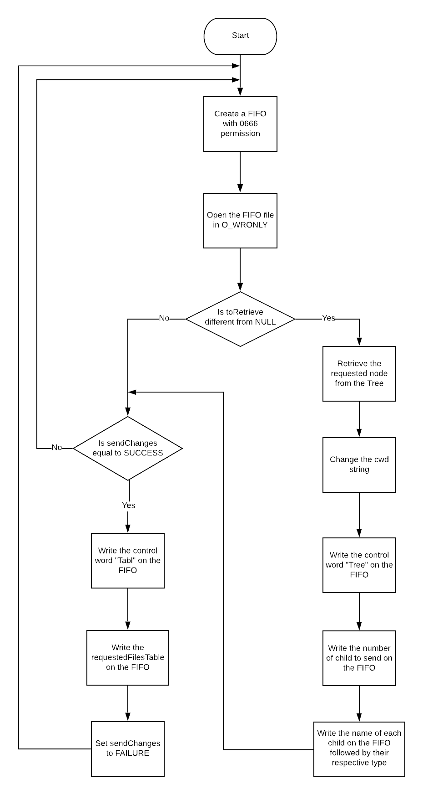

# Analyzer
Analyzer is the third element of the chain (starting from the bottom). The task of the analyzer is to keep track of the analyzed files with the help of a tree: if a node is a directory then it has a list of children. This component will get from standard input a file or a directory and, while inserting all the files in the tree, it will assign them to each manager in a fair way. The analyzer will also manage any changes in the number of the managers by spawning or killing some or them and will also handle changes to the workers amount by sending this particular information to the Managers. If needed the analyzer will send the list of children of a folder or, for the requested files, the sum of all the tables associated to the file, group by each character.

## Structure
The structure of an analyzer is basically composed by five threads:

* readDirectivesLoop that reads directives from standard input
* fileManageLoop that handle the file and directory's tree obtained from the directives
* sendFileLoop that comunicate with managers
* readFromFIFOLoop that reads the reporter's directives
* writeOnFIFOLoop that accomplishes reporter requests

### Tree
All the infos about files and directories are stored in a tree; each node except the root node can have one parent and multiple children saved in a list. Root node doesn't have a parent but has children, it also has the destructor that will be execute on each node when the function destroyTree is called.
The basic TreeNode contains:

* data
* children
* parent

The data stored in the node is a FileInfo instance that consists in:

* name
* fileTable, table that contains all the occurrences of a file groupped by character
* path
* isDirectory, flag that tells if the current node is a file with the value 0 or a directory with the value of 1
* isRequested, flag that tells if the current node is a requested file with the value 0 or if it is not with the value of -1

#### File/Directory insertion
When the analyzer receives a file or a directory to process it stores all the information in order to mantain a sort of file system hierarchy. 
When a path is obtained the analyzer will firstly compact it by removing references to the same folder and then process the node where the insertion will begin, starting from root of the tree if the path is absolute or the current folder if the path is relative, and by going up the chain of fathers or the chain of children.
Basically the insertion function will first of all check if the starting node has children, if not it will attach the new node to it; if yes, the search is performed scanning each node of the current one, if the path of the file to insert is contained in a node, which is a directory, the function will continue analyzing the children of that one; this process will end until the correct location of the file is found.

### Read Directives Thread
In the Read Directives thread all inputs from the stdin are analyzed and if they match a specific pattern, (Path, Number of Managers, Number of Workers) then it changes the number of managers proportionally with the actual number in memory if needed. After this first operation the path given is checked in order to verify if it's a directory or a file: if that's the case the path is enqueued in the candidateNode List, otherwise the thread waits for the next input. The special path "///" is used if the user would like to only change the number of Workers of each Managers without adding new files to analyze.

### Manage File Thread
If a file was inserted in the candidateNode List it is then extracted in this particular thread (but only if the readFlag is different from SUCCESS to avoid possible overwrites). The node extracted is then inserted directly into the tree and into the fileToAssign List if it's a file, otherwise it'll be spawned a find process, using a bash call, in order to check all the directories and their file inside the one passed in input. In order to not block the operations in the other thread only a file at time is read from the spowned process and, as said before, it won't be possible to extract another node while this operation is still running in order to avoid any kind of overwrite. The process for the file described just above is performed for each file read from the find process.

### Send File Thread
In this thread two different operations are performed.
In the first half each managers is extracted and its pipe is checked: if there's something to read then the path of a file is read from the pipe. The path obtained is checked with all of the files in the filesInExecution List of the manager and in case of a match a flag is setted. After this operation 129 numbers are read from the pipe and if the file was found in the previous operation the file's table is updated. If the file is also requested before updating the amount of a specific character the actual amount is substracted from the requestedFilesTable and then the same table is updated with the new amount. At last the control word sent from the manager is checked: if it's equal to "done" then the file is removed from the filesInExecution List of the Manager (if the file is requested then the sendChnages flag will be set), if the control word is "undo" then no operation will be performed (if the file is requested the same operation will be perfomed as described above), otherwise the user will be informed of a comunication error between manager and analyzer.
In the second half if the filesToAssign List isn't empty then the manager with less files is extracted from the priorityQueue and then the file is first sent and then it's inserted in the manager's fileInExecution List. If the manager's pipe is full (or if the informations' size is greater than the reamining space on the pipe) then the file won't be sent, the file won't be extracted from the filesInExecution List and the thread will not be blocked on the write.

### Read FIFO Thread
After checking if the "reporterToAnalyzer" file exists a FIFO is opened between the analyzer and the reporter in O_RDONLY in order to read the operations sent from the reporter. There are three main operations that can be performed:

* with "dire" the path, the number of Managers and the number of Workers are popped from the List of readed words and then an operation which is identical to the one described in the Read Directives Thread is performed.
* with "//" the element in the requestedFiles List and the requestedFilesTable are resetted and, while there are still element in the readed word List, the files with a matching path to the one popped are setted as requested and their table is summed with the requestedFilesTable. After this operation the flag sendChanges is setted.
* with "tree" the path to retrive is popped from the readed word List and path is then saved inside toRetrive variable.

If the word read is different from the previous ones and also different from "" (empty string) then the word is enqueued into the readed words List ontherwise the FIFO is closed.

### Write FIFO Thread
In this thread the informations requested from the reporter are sent. First thing first if the file "analyzerToReporter" doesn't exists then it's created. After this operation a FIFO in O_WRONLY mode is opened. In the first half of the loop the toRetrive variable is checked and if it's different from NULL then a file with a matching path to the one saved in the variable is searched inside the tree and the children of the retrived node are sent to the reporter using the format "tree" "number of children" "fileName1" "fileName2" ...
In the second half of the loop the sendChanges variable is checked and if it's setted then the word "tabl" followed by the requestedFilesTable (which means 129 numbers) are sent to the reporter.

## Considerations
The analyzer is and his working chain (managers and workers) performs wells, the threads that compose it allows it to both answer at user input and process the given files.