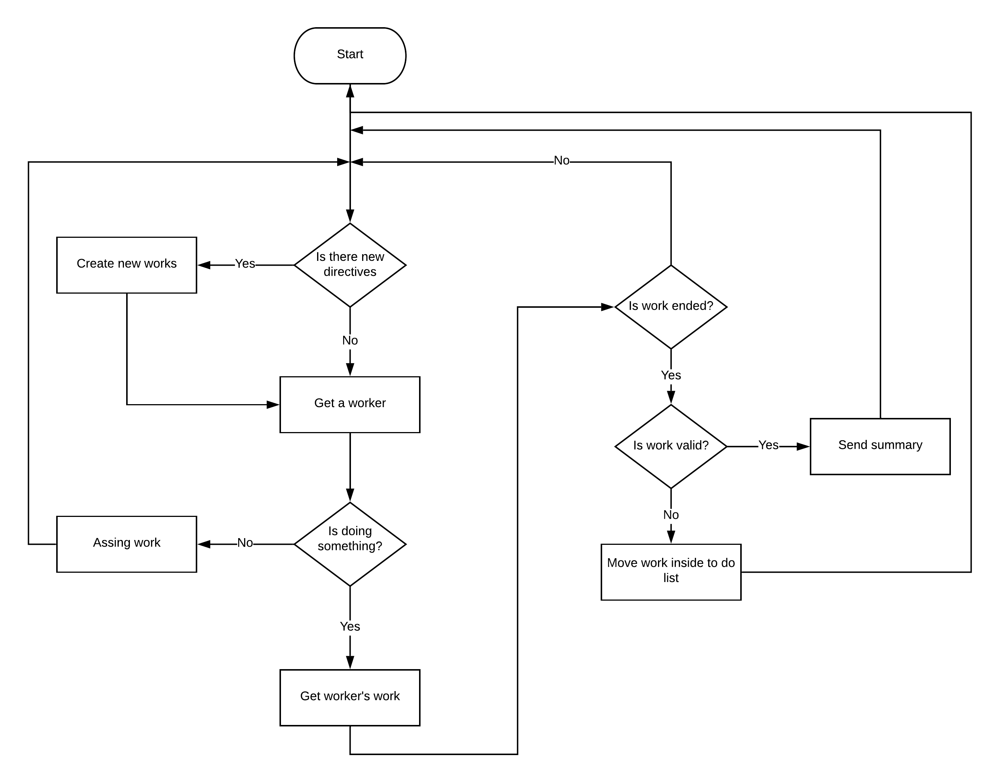

# Manager
Manager is the second element of the chain (starting from the bottom). The task of a manager is to get from standard input a file then split it into multiple works and assigns them to workers. The directive through user or other component can communicate with a manager must be in this specific form:

* a string that indicates the path file name
* a number that indicates the number of worker that the manager must handle

## Structure
The structure of a manger is basically composed by two threads. One reads from standard input for new directives, the other communicates with workers.

### Directives thread
The task of this thread is very simple:

1. read from standard input the path
2. read from standard input the number of workers
3. post processing the input
4. enqueue new directives in a pending list

### Work thread
The task of this thread is composed by some sequentially steps:

1. check if new directives were added
2. assign to do work to a pending worker
3. read worker's work
4. send to standard output a summary

#### New directives
If a new directive was added the size of the file is analyzed, then works equal to current number of workers are created splitting the total size of the file.

If the worker amount changes during the execution, all doing works become invalidated and are split in multiples works. This operation is made for efficiency and parallelism reasons.

#### Read worker's work
Workers' works are read once for cycle. The manger try to read all worker's work amount for efficiency reason. After all work is sent the worker send a control word in order to notify if everything is ok. If done is received, manager marks as ended the worker's work, otherwise worker's work is moved in to do list.

#### Spawn process
By default a manger spawns four worker. The spawn process consists in:

1. creates two pipes (one for read, another for write)
2. set pipes as non blocking
3. fork a child
4. override child's standard input and output
4. change the child's code calling worker binary

#### Is alive process
After spawn process manager saves the process ID of the spawned process. This process ID is used to check if the worker, for any reason, is dead. If so, the worker's work is moved in to do list and new worker is spawned.

## Considerations
In very stressful situations manager seems very slow and greedy of resources. The problem is caused by the limit size of the pipe. As a matter of fact the code is very good and fast. If you want to unlock the true power edit the file which inside there is the limit size of the pipe.
