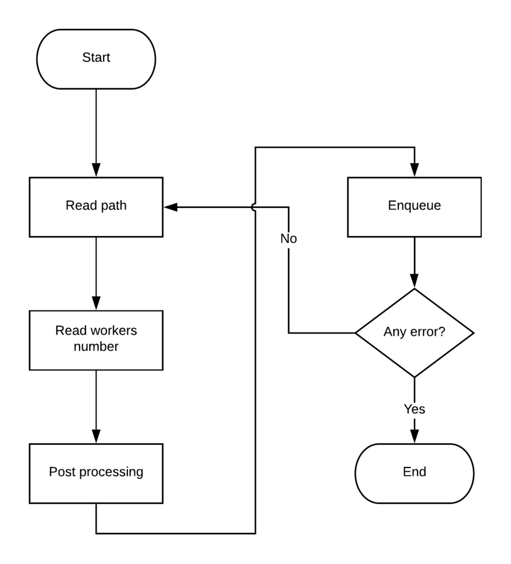

# Manager
Manager is the second element of the chain (starting from the bottom). The task of a manager is to get from standard input a file then split it into multiple works and assigns them to workers. The directive through user or other component can communicate with a manager must be in this specific form:

* a string that indicates the path file name
* a number that indicates the number of worker that the manager must handle

## Structure
The structure of a manger is basically composed by two threads. One read from standard input for new directives, the other communicates with workers.

### Directives thread
The task of this thread is very simple:

1. read from standard input the path
2. read from standard input the number of workers
3. post processing the input
4. enqueue new directives in a pending list

By default a manger spawns four manager. The spawn process consists in:

1. creates two pipes (one for read, another for write)
2. set pipes as non blocking
3. fork a child
4. override child's standard input and output
4. change the child's code calling worker binary
