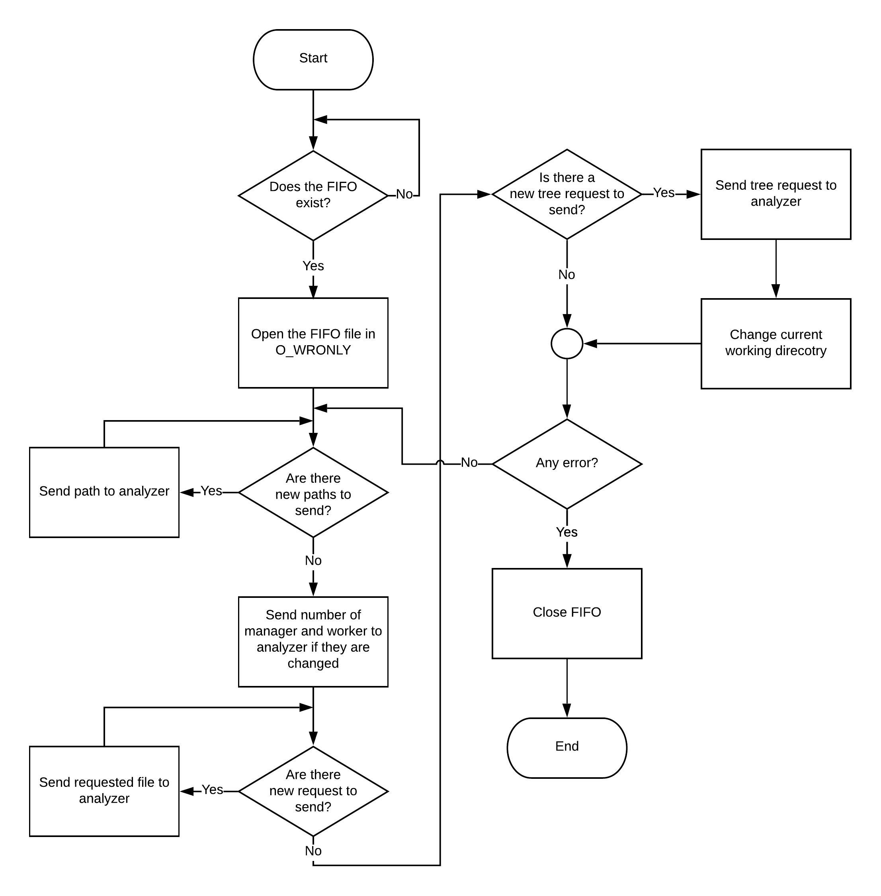

# Reporter
The reporter is the component that allows the user to communicate with the chain structure of the system. It is the gateway between the analysis part of the program and the commands of the user. When the reporter is started, depending on the size of the terminal where it is called, starts the system with the tui or with a more basic and less comfortable to use interface. The reporter can receive various commands like send new files to analyze, require the system to compute statistics on files and show the results of the computation. Depending on the command received, the reporter communicates to the analyzer to do what the user want. When the analyzer has some results of the computation, the reporter receives this data and shows them to the user.

## Structure
The reporter is composed of 3 threads, but it also uses 2 thread of the tui:
* readFifoLoop that reads the analyzer's computed data
* writeFifoLoop that sends user's requests to the analyzer
* userInputLoop that reads the input of the user and gives feedbacks to the user if necessary
* inputLoop (tui) that does the same operation of userInputLoop when the tui mode is used
* graphicsLoop (tui) that draw the terminal user interface

### Read fifo thread
This thread is charged of checking if the "analyzerToReporter" FIFO file exists and in case of success, the FIFO is opened between the reporter and the analyzer in O_RDONLY in order to read the data sent from the analyzer. There reporter can read 2 type of data:

* with "tabl" the reporter reads the data that analyzer computed for the current requested files and directories.
* with "tree" the reporter reads the files and directory that are contained in the current work directory (used in tui mode only to populate the file system area).

### Write fifo thread
In this thread the information requested by the user are sent to the analyzer. First of all, this thread checks if the "reporterToANalyzer" FIFO file exists and in case of success, the FIFO is opened between the reporter and the analyzer in O_WRONLY mode in order to write different commands to analyzer:

* send directives: the reporter sends new files or directories that the analyzer must compute, but also sends the number of managers or the new number of the workers if the user wants to change it
* send results: the reporter asks the analyzer to send back the results of the analysis of a list of typed/discovered files
* send tree (tui mode only): the reporter asks to receive the files and directories that are contained in the current working directory

### User input thread
This thread is only used when the program starts without tui. This thread allows user to insert command that are send later to analyzer: 

* with "dire" the user can write new file or folder that the system must analyze and can change the amount of worker and/or manager
* with "requ" the user can insert a list of files to read the analysis about  
* with "resu" the user can see the statistics that the system calculated during the execution 
* with "quit" the user can close the program

## Current working directory
The current working directory and the paths have different meaning based on the type of interface the user interacts with. With the basic mode the cwd is the directory where the reporter is executed (or where the main component is executed) and does not change during the execution, while with the tui the cwd is displayed in the dedicated block of the in interface and is changed when the user in tree mode types the name of a folder or .. (double dot). 

## Consideration
The reporter's work seems to be not so important, but it is a central node because it is the bridge between the chain of processes that analyze the files and the user.
