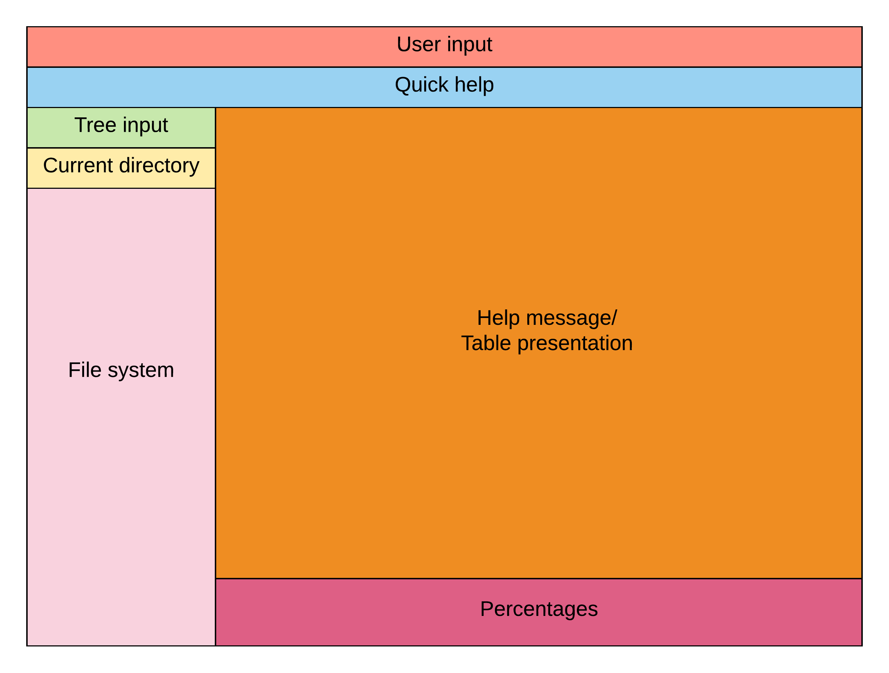
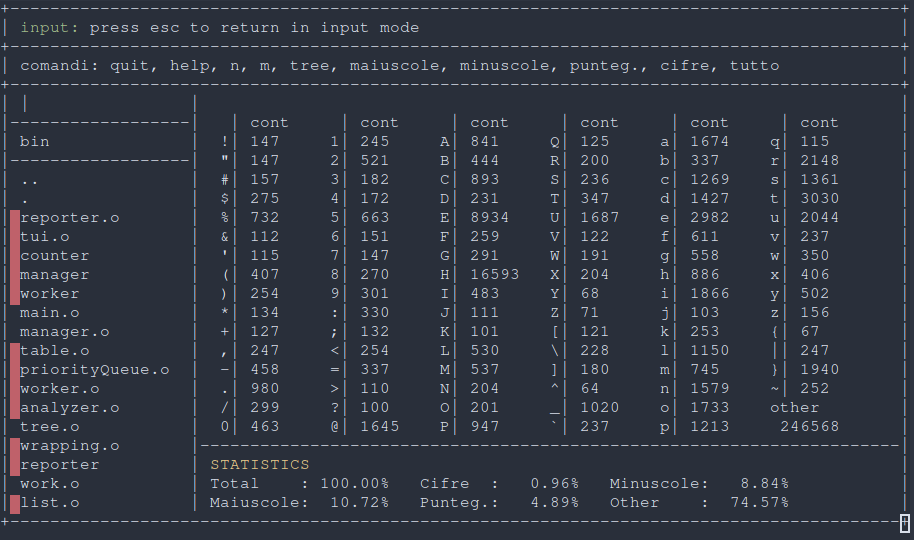

# Tui
The terminal user interface is the not necessary component of the system but at the same time is the most used by the user. Our goal was to offer a good user experience despite the terminal environment. The first problem was with the low variety of libraries. We decided to use termios, a very low level library that allows to change the terminal in raw mode.

## User interface
The user interface is divided in 7 specific blocks, each of them may has different refresh level in order to improve the usability. A little brief:

* **User input**: user input block takes file or directory path from the user.
* **Quick help**: quick help block displays all possible commands for user input block.
* **Tree input**: tree input block allows to move in the file system.
* **Current directory**: current directory block displays the current directory.
* **File system**: file system block displays files and directories of the current directory.
* **Percentages**: percentages block displays the percentages of some groups of char over the total.
* **Help message/Table presentation**: this block display the help message or the table that contains the count

## Implementation
In order to draw everything on the screen we take the current width and height of the terminal and we create a chars grid width*height. Then there is a thread that:

1. cleans the screen
2. print all the grid
3. sleep for a specific amount of time
4. repeat

A huge difference was made by the raw terminal mode and by the ansi escape code. Raw terminal mode allows us to take keyboard events and with them we could write char directly on the grid.
Ansi escape code instead allows us to clear the screen, move the cursor and print some char in different colors.

All TUI is focused on concept of movement inside the file system toggling files. When a file is toggled/untoggled a request is sent to the analyzer through reporter in order to get the table that represents the sum of all files' table.

### User input
User input block is populated after a key is pressed. When line feed is pressed the text is parsed. If the processed text is an input it is passed to reporter that sends the input to the analyzer. Instead if the input is a command some changes are made. The command are:

* **quit**: quit the application
* **help**: display the help message
* **n**: change the worker amount
* **m**: change the manager amount
* **tree**: pass in tree mode and move cursor in tree input block
* **maiuscole**: highlight only upper case letters on the table
* **minuscole**: highlight only lower case letters on the table
* **punteg.**: highlight only punctuation letters on the table
* **cifre**: highlight only digits on the table
* **tutto**: highlight all ASCII letters on the table

### Tree input
Tree input block is populated after a key is pressed only if the tree command was typed on the user input. The tree input has four different types of input:

* file: when a file is written it becomes toggled if previously wasn't, otherwise becomes untoggled
* directory: when a directory is written the program change the working directory and file system block change according to them
* commands: there are two commands
  * . dot toggles all untoggled files in the current directory (vice versa)
  * .. double dot moves backward it the file system
* down/up arrows: if the children of the current directory is more than the line of the file system block, with the down and up arrow the user can easily scroll them

## Considerations
Develop this component was very challenging and due the small amount of time given for this project and our inexperience with low level system call some parts of the code may be a little hard coded. Also our implementation may not be the most worth and easily to write but suits perfectly our needs.

