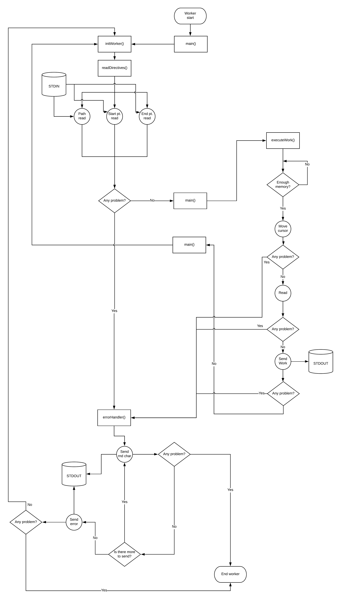

# Worker
The worker is the lowest component of all the hierarchy. The task of a worker is to read a portion of the file very quickly. The following directives are read from standard input:

* a string that indicates the path of the file
* a number that indicates the offset where the worker must start its work
* a number that indicates the offset where the worker must end its work

Start and end points are included in the read operation. After the reading operation from the standard input, the worker casts the two numbers and returns an error in case of failure.

Before the whole process starts, the worker checks if there is enough memory for allocation. If so he allocates all work amount. If the available memory is smaller than the work amount, the worker tries to allocate the 50% of the available memory.

When the work is finished the worker tries to read new directives from the standard input.

## Considerations
The worker can read huge file (we test it with a single file of 15 GB). This is the main reason for using unsigned long long type. The read operation is split if the work amount assigned to the worker is greater than 1.0 GB. We made this choice because the kernel doesn't allow big read operation in one time. 

The atomicity of the write operation is 4096 Bytes but in this case is not a problem because other components wait for it.

The worker performance are very impressive. The 15 GB file was read in about 30 seconds (intel i7 7th gen, 40 Gb ram and ssd), the main problem is the usage of the pipe for the communication because their limit size is about 65000 bytes (depends on the OS).

